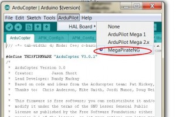
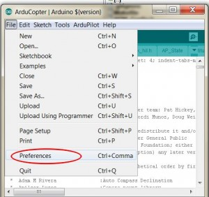
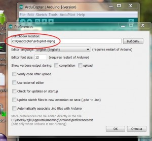
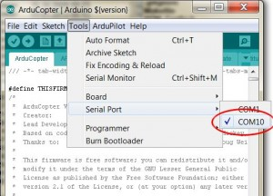

# How to compile MegaPirateNG source

## Prerequisites

* ArduPilot-Arduino 1.0.3

  You need a special version of the Arduino software to compile the source.
  * [ArduPilot-Arduino-1.0.3 for Windows](http://ardupilot.com/downloads/?did=45) (~95 MB)
  * [ArduPilot-Arduino-1.0.3 for MacOSX](http://ardupilot.com/downloads/?did=44) (~80 MB)

* The latest sourcecode

  * [MegaPirateNG - APM:Copter 3.0.1-R3](https://github.com/SirAlex/ardupilot-mpng/archive/mpng-3.0.1-r3.zip)
  * [MegaPirateNG - APM:Plane 2.76](https://github.com/smurfy/ardupilot-mpng/archive/mpng_ArduPlane-2.76.zip)
  * [MegaPirateNG - DEV Version](https://github.com/SirAlex/ardupilot-mpng/archive/master.zip)

  If you know your way around GIT you also can clone the respective repository from github.com

## Prepare your Environment

* Extract ArduPilot-Arduino 1.0.3, for example to ```c:\quadcopter```

  You now should have a directory called ```ArduPilot-Arduino-1.0.3-windows``` (Windows) or an ```Arduino``` application (MacOSX) in the ```c:\quadcopter``` directory.
* Extract the downloaded source code, for example to ```c:\quadcopter```

  You now should have a new directory in the ```c:\quadcopter``` directory called like the zip file.
  In our example we use the name ```ardupilot-mpng``` for this directory.

* ***Important*** Replace the shipped ```pde.jar``` from the source directory to the ardupilot-arduino software.

  Windows:

  Locate the ```pde.jar``` in your sources root directory for example ```c:\quadcopter\ardupilot-mpng\pde.jar```,
  copy and replace the file with the file in ```c:\quadcopter\ArduPilot-Arduino-1.0.3-windows\lib```

  MacOSX:

  Locate the ```pde.jar``` in your sources root directory for example ```~username/quadcopter/ardupilot-mpng/pde.jar```,
  copy and replace the file with the file in ```~username/quadcopter/Arduino.app/Contents/Resources/Java```
* Start ArduPilot-Arduino

* Change the target-platform to MegaPirateNG

  
* Open preferences and set the sketch folder to the source code directory, for example ```c:\quadcopter\ardupilot-mpng```

  
  

  You also should uncheck the "Update sketch files to new extension on save" checkbox.

* Connect your Flight Controller to your Computer and set the Serial Port in the Arduino IDE

  

* ***Important*** Restart the Arduino IDE

## Compiling

Now open your desired APM Autopilot Platform (ArduCopter, ArduPlane...) via ```File > Sketchbook```.

To compile the source code, pressing either the first icon in the toolbar or press ```ctrl+R```.

If your source compiles without a problem you are ready to begin to configure your UAV.
