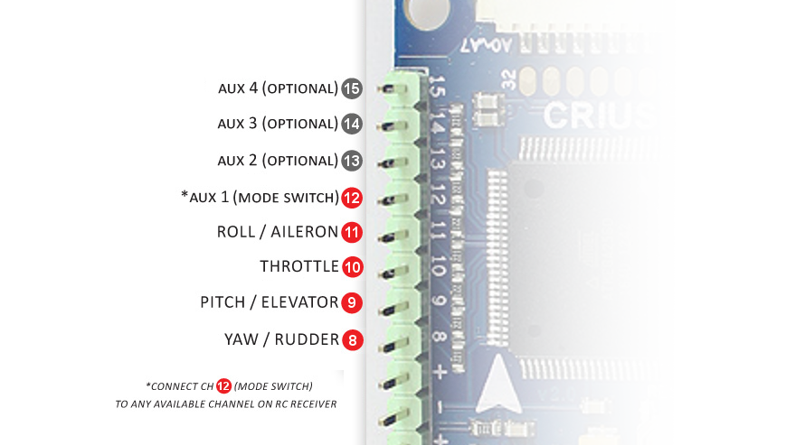

# APM:Copter - Connecting your components

## Connecting the RC Input to a Crius V2

## Connecting Motors

This documentation is missing.
For now please refer to:

* [Old MegaPirateNG Wiki](http://code.google.com/p/megapirateng/wiki/confighw?wl=en)
* [Official APM:Copter documentation](http://copter.ardupilot.com/wiki/connecting-your-rc-input-and-motors/)