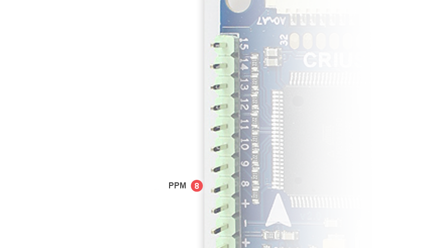

# APM:Copter - Connecting your components

The documentation uses a Crius V2 as example flight controller,
but the Pin number is the same for all flight controllers.

## Connecting the RC Input

By default MegaPirateNG uses PPM RC Input.

Connect your PPM RC Receiver to ```Pin A8``` on your flight controller.



If you want to use a non PPM RC Receiver you need to change your [RC Input Type Configuration](general_configuration#rc_input_type_configuration)
and connect the RC Receiver like this.

| Pin  | Channel          |
| -----|:----------------:|
| A8   | Yaw / Rudder     |
| A9   | Pitch / Elevator |
| A10  | Throttle         |
| A11  | Aileron          |
| A12  | Mode Switch      |


## Connecting Motors

This documentation is missing.
For now please refer to:

* [Old MegaPirateNG Wiki](http://code.google.com/p/megapirateng/wiki/confighw?wl=en)
* [Official APM:Copter documentation](http://copter.ardupilot.com/wiki/connecting-your-rc-input-and-motors/)