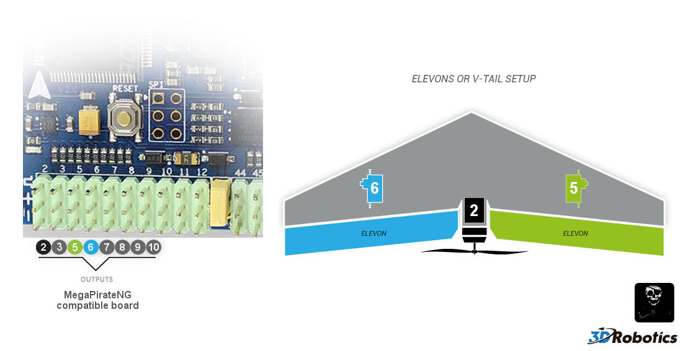

# APM:Plane - Connecting your components

The documentation uses a Crius V2 as example flight controller,
but the Pin number is the same for all flight controllers.

## Connecting the RC Input

By default MegaPirateNG uses PPM RC Input.

Connect your PPM RC Receiver to ```Pin A8``` on your flight controller.


If you want to use a non PPM RC Receiver you need to change your [RC Input Type Configuration](general_configuration#rc_input_type_configuration)
and connect the RC Receiver like this.

| Pin  | Four channel plane | Elevon setup |
|------|--------------------|--------------|
| A8   | Yaw / Rudder       | -            |
| A9   | Pitch / Elevator   | Aileron      |
| A10  | Throttle           | Throttle     |
| A11  | Aileron            | Elevator     |
| A15  | Mode Switch        | Mode Switch  |


## Motor and Servos

### Connections for a 4 channel plane setup

| Pin  | Channel          |
|------|------------------|
| D2   | Motor            |
| D3   | Ailerons         |
| D5   | Rudder           |
| D6   | Elevator         |


### Connections for a elevon plane setup

| Pin  | Channel          |
|------|------------------|
| D2   | Motor            |
| D5   | Right Elevon     |
| D6   | Left Elevon      |

Please use the new ```ELEVON_OUTPUT``` option to enable elevon support, not the old ```ELEVON_MIXING``` which causes problems and does not work.

For more information please read the [official ardupilot documentation](http://plane.ardupilot.com/wiki/arduplane-setup/first-time-apm-setup/reversing-servos-and-setting-normalelevon-mode/#New_style_elevon_mixing_EEPROM_setup_ELEVON_OUTPUT_option) on that topic.




