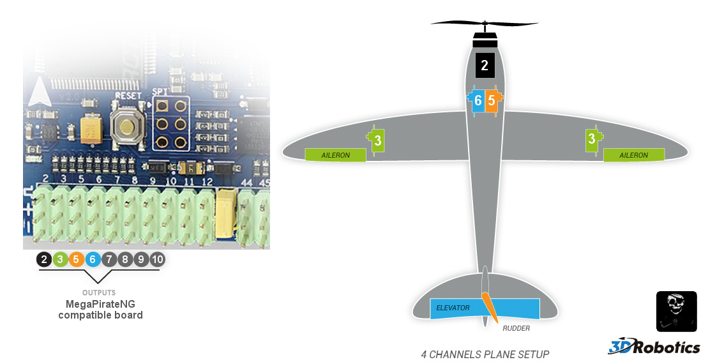

# APM:Plane - Connecting your components

The documentation uses a Crius V2 as example flight controller,
but the Pin number is the same for all flight controllers.

## Connecting the RC Input

By default MegaPirateNG uses PPM RC Input.

Connect your PPM RC Receiver to ```Pin A8``` on your flight controller.


If you want to use a non PPM RC Receiver you need to change your [RC Input Type Configuration](general_configuration#rc_input_type_configuration)
and connect the RC Receiver like this.

| Pin  | Channel          |
| -----|:----------------:|
| A8   | Yaw / Rudder     |
| A9   | Pitch / Elevator |
| A10  | Throttle         |
| A11  | Aileron          |
| A15  | Mode Switch      |


## Motor and Servos

Connection for a 4 channels plane setup.

| Pin  | Channel          |
| -----|:----------------:|
| D2   | Motor            |
| D3   | Ailerons         |
| D5   | Rudder           |
| D6   | Elevator         |

