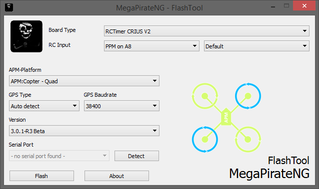

# Use the FlashTool to install firmware

There is a dedicated tool available to install MegaPirateNG on you flight-controller.
The tool is currently only available for Windows and MacOSX.

The latest version is available [here](https://github.com/MegaPirateNG/FlashTool/releases)

## What does the FlashTool do?

After you select your configuration the tool connects to the MPNG build server and submits your selection.
The build server then uses the latest code for the selected version and compiles the code for you.
After a successful build, the flashtool downloads the finished hex file and flashes it to your flight-controller.

Downloaded hex files will also be cached locally, so you only need to download the hex file once.
If the code changes you automatically get a new hex file.

## Short usage help

* Board Type: List of supported flight-controllers. Select the one you have
* RC Input: First option is what kind of Receiver you have PPM or PWM. You also can choose the input mapping for the receiver. The default mapping is shown at the [Connecting components](connecting_components) page.
* APM-Platform: Here you can select the general type of Copter or Plane you have. Special configurations like X or + configuration is set within the Mission Planner, not here
* GPS Type and Baudrate: Here you can alter your GPS configuration.
* Version: Some Platforms are available in different versions.
* Serial Port: The serialport your flight-controller is connected to. You can press the "detect" button to re-detect existing serial-ports on your computer. 

After selecting all options simple press the "Flash" button to download and install the firmware to your flight-controller.

## What the strange name of the hex file?

The first part of the hex name is a md5 hash of your configuration, the second part is the sha1 hash of the last commit of the code the hex file is based on.
