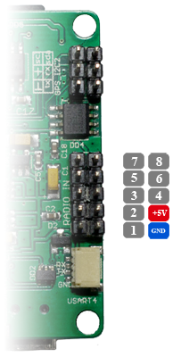
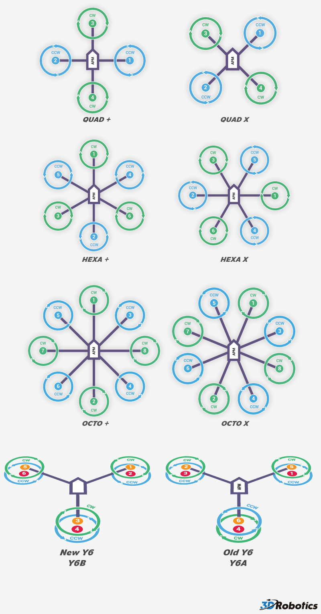

## Connecting the RC Input

You may connect your receiver via PWM, CPPM(PPM SUM), S.BUS and DSM signal(protocols).

### Connecting PWM - no jumper

### Connecting CPPM - in 1 jumper 3-4

### Connecting S.BUS - in 4 (invert) jumper 2-3

### Connecting DSM   - in 4 jumper 1-2

## Connecting Motors

