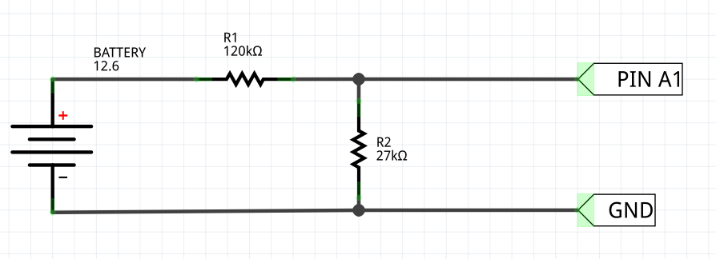
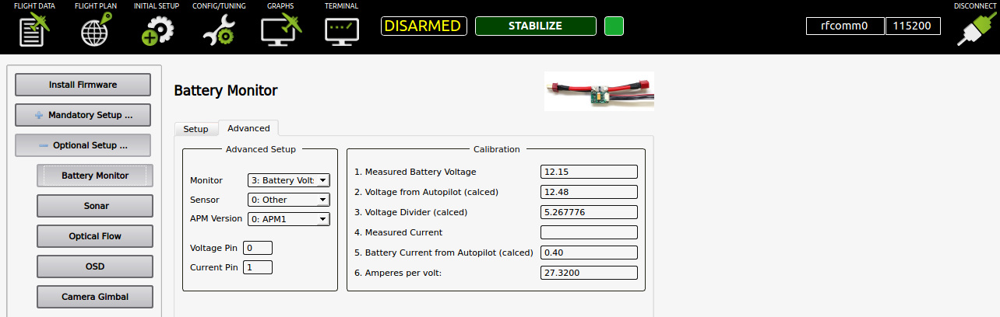

# Tips and tricks

This site tries to provide some code changes which could give you a nice extra feature.
But which is not really used by many so not an official setting.

## Get external LEDs and piezo buzzer working with Crius 1.1

The Crius board only allows you to connect ```A0 to A5``` so the default config does not work.
Here are the code-changes necessary to still have external LEDs and a piezo buzzer.

```config.h``` changes:

    #define PIEZO_PIN 46
    #define COPTER_LED_1 AN2 // Motor or Aux LED
    #define COPTER_LED_2 AN3 // Motor LED
    #define COPTER_LED_3 AN4 // Motor or GPS LED
    #define COPTER_LED_4 AN7 // Motor LED
    #define COPTER_LED_5 -1 // Motor LED
    #define COPTER_LED_6 -1 // Motor LED
    #define COPTER_LED_7 -1 // Motor LED
    #define COPTER_LED_8 -1 // Motor LED

```define.h``` changes:

    #define AN5 46
    // #define PIEZO_PIN 32 //Last pin on the back ADC connector
    #define PIEZO_PIN 46

After this changes, a compile and flash you can connect the arming led on ```A3```, the GPS led on ```A4``` and the Buzzer on ```PIN 46```.
You also need to set the ```Led Mode``` to ```127``` via Advanced parameters in the Mission Planner software.

## Use an external compass instead of using the internal

Sometimes you want to use an external compass instead of the flight controllers on board one.
In most cases its not really needed, but you have the option.

```libraries\AP_InertialSensor\AP_InertialSensor_MPU6000_I2C.cpp``` changes:

```//#define DISABLE_INTERNAL_MAG``` to ```#define DISABLE_INTERNAL_MAG```

After this changes, a compile and flash you also need to erase and reset to factory defaults via Mission Planner.

## Battery Voltage Meter on Analog PIN A1

That is just a hardware modification. Basicly you will need two resistors (R1 of 120k and R2 of 27k) hooked up like this:



So now you can go to APM Planner -> Initial Setup -> Optional Setup -> Battery Monitor -> Advanced.
There you change these stuff:

    Monitor     => 3: Battery Voltage
    Sensor      => 0: Other
    APM Version => 0: APM1
    Voltage Pin => 1
    
So now it will start measuring battery voltage. But you need to calibrate the software. So get a multimeter and measure the voltage across the battery. I recomend to use a fully charged battery (3s will give arround 12.6V and 4s will give you arround 16.4V). After you get a reference, write it on field ```1. Measured Battery Voltage``` So now it should change automatically the parameter ```3. Voltage Divider (calced)``` and start measuring the correct voltage on ``` 2. Voltage from Autopilot (calced)```



You can also use other Analog Ports ( I use A0 ) for Battery Measuring. Just change the Voltage Pin Number for that.

There is other stuff you can configure related to the Battery Voltage Monitor. For more details take a look on the oficial documentation for [Power Module set-up to measure battery voltage and current consumption](http://copter.ardupilot.com/wiki/common-measuring-battery-voltage-and-current-consumption-with-apm/)

## RSSI input on analog PIN A0

```config.h``` changes:

Around line 208 you will find:

    #elif CONFIG_HAL_BOARD == HAL_BOARD_MPNG
     # define A_LED_PIN        13
     
Change to:

    #elif CONFIG_HAL_BOARD == HAL_BOARD_MPNG
     # define RECEIVER_RSSI_PIN 0
     # define A_LED_PIN        13

```parameters.ino``` changes:

Around line 192 you will find:
    
    GSCALAR(rssi_pin,            "RSSI_PIN",         -1),


Change to:

    GSCALAR(rssi_pin,            "RSSI_PIN",         RECEIVER_RSSI_PIN),
    

After that you can enable the RSSI_PIN via MissionPlanner.
To test if it works you can connect a 1.5v battery on ```A0```
    
